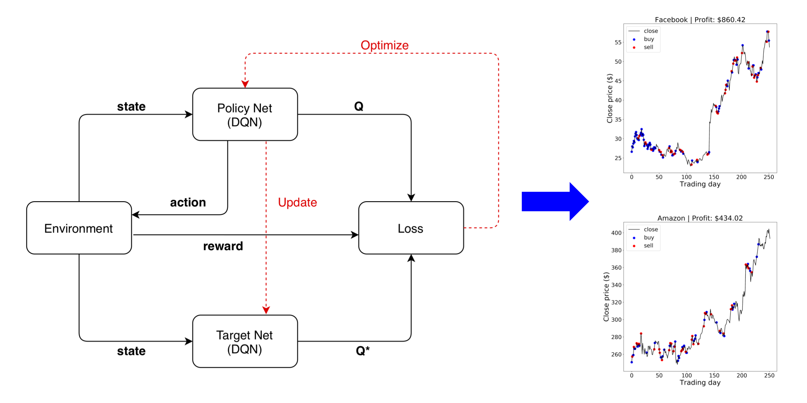
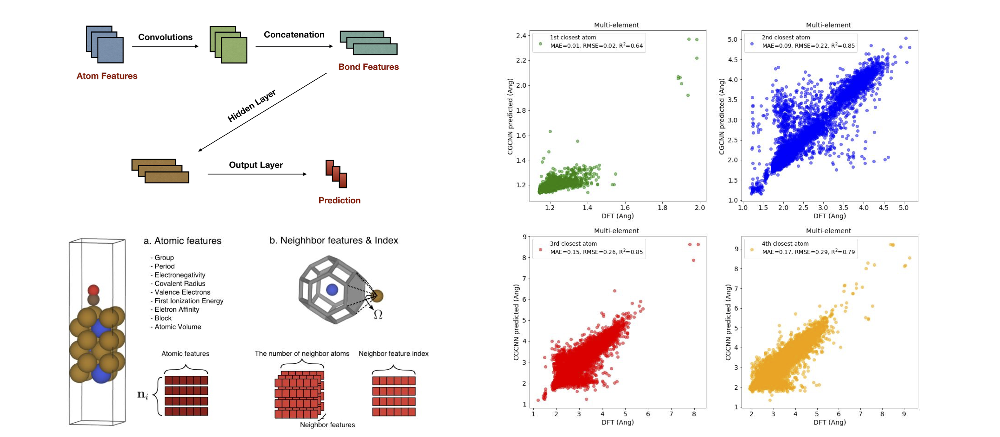
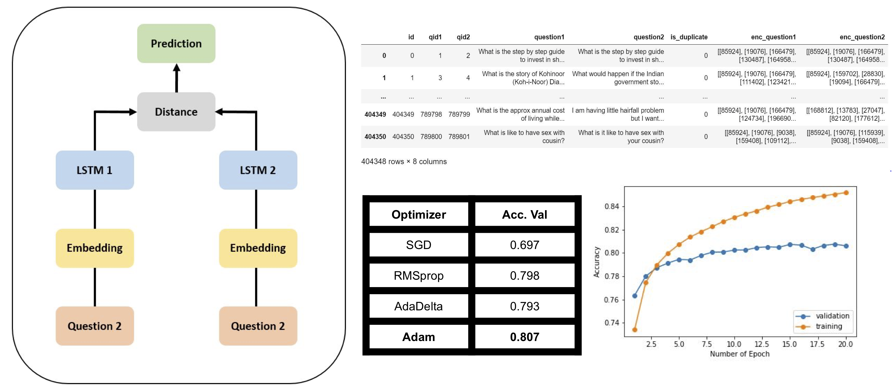

## Financial Assets Optimization with Reinforcement Learning Inference

CMU-10708 Probabilistic Graphical Models (Spring 2020)

<a href="../files/projects/10708.pdf" target="_blank" rel="noopener noreferrer"><i class="fas fa-fw fa-file-pdf zoom" aria-hidden="true"></i></a>

## Machine Learning for Data Exploration

CMU-10718 Data Analysis (Fall 2019)

[ML@CMU blog post](https://blog.ml.cmu.edu/2020/08/31/2-data-exploration/)

## Graph Convolutional Neural Network for Predicting Atomic Structures

CMU-10707 Deep Learning (Spring 2019)

<a href="../files/projects/10707.pdf" target="_blank" rel="noopener noreferrer"><i class="fas fa-fw fa-file-pdf zoom" aria-hidden="true"></i></a>

## Identifying Duplicate Questions using Siamese LSTM Architecture

CMU-10701 Introduction to Machine Learning PhD-level (Fall 2018)

<a href="../files/projects/10701.pdf" target="_blank" rel="noopener noreferrer"><i class="fas fa-fw fa-file-pdf zoom" aria-hidden="true"></i></a>
