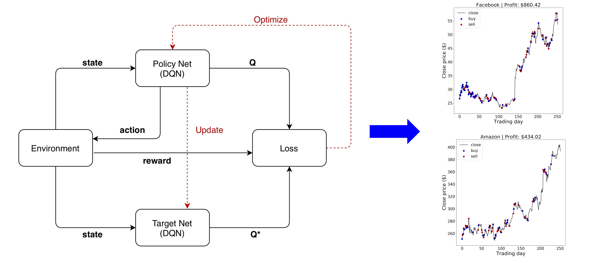

## Financial Assets Optimization with Reinforcement Learning Inference

CMU-10708 Probabilistic Graphical Models (Spring 2020)

Implemented deep reinforcement learning algorithm to forecast stock prices and make transactions that will maximize profit while considering financial factors which affect the stock prices.
<a href="../files/projects/10708.pdf" target="_blank" rel="noopener noreferrer"><i class="fas fa-fw fa-file-pdf zoom" aria-hidden="true"></i></a>

## Machine Learning for Data Exploration

CMU-10718 Data Analysis (Fall 2019)

Explored several statistical and visualization methods used for exploratory data analysis. Our research is published at
[ML@CMU blog post](https://blog.ml.cmu.edu/2020/08/31/2-data-exploration/)

## Graph Convolutional Neural Network for Predicting Atomic Structures

CMU-10707 Deep Learning (Spring 2019)

Used graph neural networks to learn local chemical atomic interactions and predict equilibrium configurations of inorganic structures. 
<a href="../files/projects/10707.pdf" target="_blank" rel="noopener noreferrer"><i class="fas fa-fw fa-file-pdf zoom" aria-hidden="true"></i></a>

## Identifying Duplicate Questions using Siamese LSTM Architecture

CMU-10701 Introduction to Machine Learning PhD-level (Fall 2018)

Implemented Siamese Long Short Term Memory networks to identify duplicate questions for efficient knowledge sharing on websites such as Quora and Stack Exchange.
<a href="../files/projects/10701.pdf" target="_blank" rel="noopener noreferrer"><i class="fas fa-fw fa-file-pdf zoom" aria-hidden="true"></i></a>
